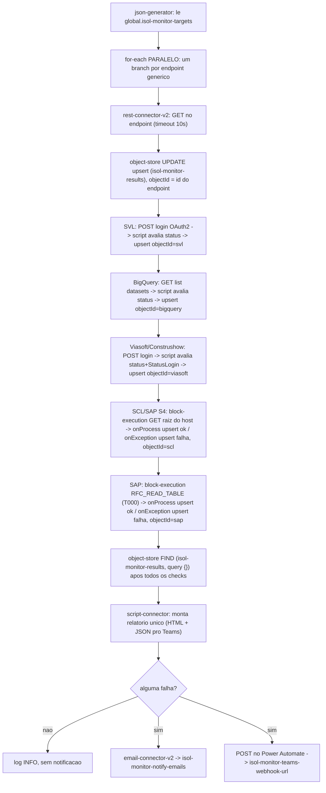

# Monitor de Conexões (ISOL) — guia de setup na Digibee

Pipeline Digibee standalone que testa periodicamente uma lista de endpoints
HTTP genéricos **e** um conjunto de branches dedicados e autenticados por
sistema (SAP, SVL, BigQuery, SCL, Viasoft/Construshow), e manda **um
relatório consolidado** (e-mail + Teams) quando algo falha. Vive só na
Digibee — **não** faz parte do runtime do Inventário de Soluções; o
Inventário não tem (e não deve ter) acesso aos valores reais dessas
variáveis.

- Arquivo do flow: `digibee-connection-monitor.flowspec.json` (raiz deste repo)
- Prefixo/infixo `isol` em tudo que for **específico deste monitor**
  (variáveis/accounts novos). Os 5 branches autenticados abaixo **reusam
  contas de produção já existentes no tenant** (`sap-user`, `svl-auth`,
  `bigquery-auth`, `viasoft-auth`, `sap-s4-scl`) — não recrie essas com
  prefixo isol, mesma lógica já aplicada a `dgb-internal-object-store-account`.
- Nada abaixo foi criado por mim — eu não tenho credencial nem acesso ao
  tenant Digibee. Este arquivo é só o roteiro do que fazer na Studio.

## Como o flow funciona



O upsert por `objectId` (não um acumulador em memória/sessão) é o que torna
seguro rodar o `for-each` genérico em **paralelo**: cada endpoint escreve só
a própria linha, sem disputa entre iterações concorrentes. Os 5 branches
autenticados rodam **sequencialmente** (não em paralelo) — cada um escreve na
sua própria linha fixa (`objectId` = `svl`/`bigquery`/`viasoft`/`scl`/`sap`),
então não há disputa entre eles, mas também não há um construtor de
paralelismo genérico validado neste corpus para juntá-los (`parallel-execution-connector`
existe no catálogo mas não tem nenhum exemplo real usado como referência —
ver "Limitações" abaixo).

## Checklist — recursos a criar na Digibee Studio

### Global variables

| Nome | Secret? | Valor |
|---|---|---|
| `isol-monitor-targets` | não | JSON com a lista de endpoints — ver formato abaixo |
| `isol-monitor-notify-emails` | não | destinatários do e-mail de falha |
| `isol-monitor-teams-webhook-url` | **sim** | URL do Workflow do Power Automate |

### Accounts — novos, específicos deste monitor

| Nome | Tipo | Observação |
|---|---|---|
| `smtp-isol-monitor` | SMTP (para `email-connector-v2`) | credenciais do servidor de e-mail |
| `http-isol-monitor-no-auth` | REST (para `rest-connector-v2`) | sem autenticação real — a Digibee pode exigir um account mesmo assim; confirme na Studio antes do primeiro teste |

### Accounts — reaproveitados (NÃO criar com prefixo isol, NÃO duplicar)

Estes já existem no tenant, usados por pipelines de produção reais. O
monitor reusa exatamente a mesma credencial que o sistema já usa hoje —
isso é intencional: testar com uma conta "de brinquedo" não provaria que o
sistema real está de pé. A contrapartida é carga extra sobre uma credencial
de produção a cada rodada do monitor (ver "Limitações" abaixo).

| Nome | Tipo | Usado por (pipeline de referência real) |
|---|---|---|
| `dgb-internal-object-store-account` | Object Store | `iam-svl-token-cache`, `anchor-1` e outras — account compartilhado de Object Store de todo o tenant |
| `sap-user` | SAP (RFC) | `status-pedidos`, `sap-buscar-ordens`, `servico-preco` |
| `svl-auth` (`accountLabels.custom-1`) | Basic/custom (client_id/client_secret) | `get-token-svl` |
| `bigquery-auth` | REST (Google auth) | `sch-processa-update-clientes` |
| `viasoft-auth` (`accountLabels.custom-1`) | Basic/custom (AUser/APassword) | `get-token-viasoft` |
| `sap-s4-scl` | REST | `scl-criapedido` |

### Global variables reaproveitadas (precisam já existir e estar corretas)

Nenhuma delas é criada por este monitor — são as globals reais que os
sistemas de produção já usam. Se algum desses valores estiver errado/vazio no
seu tenant, o branch correspondente vai falhar mesmo com o sistema real
saudável (falso positivo) — não é uma variável nova, é uma dependência.

| Sistema | Global vars |
|---|---|
| SAP | `sap-servidor`, `sap-client-id`, `sap-instance-number` |
| SVL | `url-token-svl`, `param-audience-svl` |
| BigQuery | `url-bigquery-projects`, `bigquery-project-id` |
| Viasoft/Construshow | `url-token-viasoft` |
| SCL / SAP S4 | `url-base-sap-api` |

### Object Store

| Nome | Observação |
|---|---|
| `isol-monitor-results` | novo store, criado na primeira execução do pipeline (upsert cria a coleção se ela não existir — confirme esse comportamento na Studio) |

### Pipeline

Sugestão de nome ao importar: **`ISOL - Monitor de Conexões`** (ou equivalente
com o prefixo, para achar fácil na lista de pipelines do tenant).

## Passo a passo — Global variables

### `isol-monitor-targets`

JSON com um objeto por endpoint monitorado. Os três campos (`id`, `name`,
`url`) são obrigatórios — `id` precisa ser único e estável (é a chave do
upsert no Object Store; não muda entre rodadas, senão vira uma linha nova em
vez de atualizar a existente). O valor tem que ser JSON **literal** (URLs
reais, sem `{{global.*}}` dentro — Double Braces não resolve recursivamente
dentro do valor de outra global var):

```json
[
  { "id": "erp-sap", "name": "ERP SAP", "url": "https://erp.leomadeiras.com.br/health" },
  { "id": "svl", "name": "SVL", "url": "https://svl.leomadeiras.com.br/status" }
]
```

Esse exemplo acima é ilustrativo. Para os sistemas **reais** já usados nas
pipelines de produção — levantado via export local do `digibeectl`, com a
lista completa de endpoints/conexões por sistema, quais são HTTP (compatíveis
com este monitor) vs. quais precisam de conector dedicado (SAP/RabbitMQ/SFTP/
LDAP), e um alerta sobre `Common/health-check-viasoft` já existir e rodar
agendada — ver `digibee-real-connections-inventory.md`.

### `isol-monitor-notify-emails`

Lista de destinatários no formato que o `to` do `email-connector-v2` espera
na sua conta (geralmente separado por vírgula: `"fulano@leomadeiras.com.br,ciclano@leomadeiras.com.br"`).

### `isol-monitor-teams-webhook-url` (secret)

A URL gerada pelo Workflow do Power Automate (ver seção abaixo) — cole o
valor e marque a variável como **secret**: depois de salva, a Digibee nunca
mais mostra esse valor de volta (nem na Studio, nem via `digibeectl`/API),
só resolve em texto puro durante a execução do pipeline. É por isso que o
teste de conexão roda como pipeline Digibee em vez de ser puxado pelo
Inventário — o valor real nunca fica acessível fora da execução.

## Passo a passo — Accounts

Um **Account** na Digibee é um objeto de credencial reutilizável, guardado
uma vez no ambiente e referenciado por `accountLabel` em qualquer step, em
vez de cada conector carregar usuário/senha embutido. Campos sensíveis
(senha) ficam mascarados/write-only depois de salvos, mesmo princípio da
global var secret.

- **`smtp-isol-monitor`** — host/porta/usuário/senha do servidor SMTP que vai
  enviar o e-mail de falha. Usado pelo `email-connector-v2` (`accountLabel`)
  e referenciado no flow via `{{ account.username }}` no campo `from`.
- **`http-isol-monitor-no-auth`** — account do `rest-connector-v2` que faz o
  GET de teste em cada endpoint. Não carrega nenhuma credencial real (os
  endpoints monitorados não precisam de auth para o teste de conectividade),
  mas não confirmei se a Digibee permite um REST call sem *nenhum* account
  selecionado — se a Studio recusar salvar o step sem um account, crie um
  account REST "vazio"/sem autenticação com esse nome.
- **`dgb-internal-object-store-account`** — **não crie um novo com prefixo
  isol.** Esse é o account de Object Store já reaproveitado por outras
  pipelines reais do catálogo (`iam-svl-token-cache`, `anchor-1`/staging de
  clientes) — se já existir no seu tenant, é só apontar pra ele; criar um
  duplicado só isolado pra este monitor não tem benefício e foge do padrão
  já estabelecido.

## Passo a passo — branches autenticados por sistema

Cada um mira o mesmo endpoint/mecanismo de auth que a pipeline de produção
real já usa hoje (levantado no export local, ver `digibee-real-connections-inventory.md`),
não um endpoint inventado — mas nenhum foi rodado de verdade na Studio, só
validado estruturalmente pelo `DigibeeFlowspecValidator`. Teste cada um
isoladamente antes de confiar no agendamento.

- **SVL** (`svl-token-check` → `svl-eval` → `svl-upsert`) — replica o
  handshake OAuth2 client-credentials de `Common/get-token-svl`: POST em
  `{{ global.url-token-svl }}` com `client_id`/`client_secret` do account
  `svl-auth`. Sucesso = status 200-299 (não precisa usar o token depois,
  só confirmar que o login funciona).
- **BigQuery** (`bigquery-check` → `bigquery-eval` → `bigquery-upsert`) —
  GET em `{{ global.url-bigquery-projects }}/{{ global.bigquery-project-id }}/datasets`
  (endpoint real da API do BigQuery para listar datasets — leitura, sem
  efeito colateral), account `bigquery-auth`. **Diferente do que o export
  local sugeria**: a única pipeline real usando `google-bigquery-sql-connector`
  no tenant é um rascunho vazio (`Common/add-log-bq-event`) — os writes de
  produção de verdade (`Construshow/sch-processa-update-clientes`) usam
  `rest-connector-v2` puro, então foi isso que o monitor replica.
- **Viasoft/Construshow** (`viasoft-token-check` → `viasoft-eval` →
  `viasoft-upsert`) — replica `Common/get-token-viasoft`: POST em
  `{{ global.url-token-viasoft }}` com headers `database-name: ConstruShowX`
  e `id-aplicacao: 90-ITEM-90` (literais reais do tenant, não segredo) e
  `AUser`/`APassword` do account `viasoft-auth`. Sucesso **não é só status
  200** — o corpo real retorna `StatusLogin: 0` em caso de sucesso mesmo com
  HTTP 200, então o script conecta as duas checagens
  (`message.status === 200 && message.body.StatusLogin === 0`).
  **Atenção**: `Common/health-check-viasoft` já roda agendada de verdade
  (a cada 10min, 8h-19h) e já notifica via `event-publisher-connector` — mas
  ela testa só o token **em cache**, não faz o handshake de login do zero
  como este branch faz. São checagens diferentes (login vs. token
  cacheado), mas ambas cobrem "Viasoft está de pé" — considere se quer as
  duas rodando e alertando em paralelo, ou aposentar uma.
- **SCL / SAP S4** (`block-execution-connector` → `scl-rest-check`/
  `scl-mark-ok` no `onProcess`, `scl-mark-falha` no `onException`) — **não**
  chama `CriaPedido` nem o callback de status (ambos criam/alteram pedidos
  reais no SAP — inaceitável rodar num scheduler). Faz só um GET na raiz de
  `{{ global.url-base-sap-api }}`, sem o path `/http/v1/leomadeiras/scl/CriaPedido`,
  com `stopOnClientError`/`stopOnServerError` em `false` — então um 404/401
  na raiz **ainda conta como "ok"** (o host respondeu, só não tem rota
  cadastrada em `/`), e só uma falha de conexão de verdade (DNS, timeout,
  conexão recusada) cai no `onException` e marca falha. Isso é
  **deliberadamente mais fraco** que os outros branches: confirma que o host
  está de pé, não que o fluxo de criação de pedido funciona.
- **SAP** (`block-execution-connector` → `sap-rfc-check`/`sap-mark-ok` no
  `onProcess`, `sap-mark-falha` no `onException`) — chama `RFC_READ_TABLE`
  pedindo 1 linha da tabela `T000` (tabela de clientes/mandantes do próprio
  SAP — leitura, universal, zero efeito colateral), account `sap-user`,
  mesmo padrão de `Projetos 2020-2021/teste-conectividade-sap`. RFC não tem
  um campo de status HTTP — sucesso/falha é "lançou exceção ou não", por
  isso o `block-execution-connector` (try/catch nativo da Digibee) em vez
  de um `choice`. **Não confirmei o formato exato do `body`/`sapRequestTemplate`
  do `sap-connector`** — o único exemplo real no export é o teste manual, que
  não me deu o body completo; teste esse step isoladamente na Studio antes
  de confiar nele.

## Configurar o Workflow no Power Automate

1. Trigger: **"Quando uma solicitação HTTP do Teams webhook é recebida"**.
2. No editor de schema do corpo, "Gerar a partir de um payload de exemplo",
   colando:
   ```json
   {
     "title": "Monitor Digibee - 1 falha(s) detectada(s)",
     "text": "1 de 2 endpoint(s) com falha:\n- SVL (https://svl.leomadeiras.com.br/status): status 500"
   }
   ```
3. Ação **"Postar em um chat ou canal"** (ou "Postar cartão adaptável" para
   algo mais visual depois) — canal de destino, mensagem usando o conteúdo
   dinâmico `title`/`text` do trigger.
4. Salvar gera a URL do webhook — esse valor vai em
   `isol-monitor-teams-webhook-url` (marcada secret, passo acima).

## Importar o flowSpec e agendar

1. Importar `digibee-connection-monitor.flowspec.json` na Studio (novo
   pipeline, nome sugerido acima).
2. Adicionar um **Schedule Trigger** na pipeline com o intervalo desejado —
   isso **não** faz parte do JSON, é configuração de pipeline separada.
3. Publicar e rodar uma vez manualmente antes de confiar no agendamento.

## Limitações conhecidas (v1)

- Só testa HTTP simples (GET, 2xx = ok) no loop genérico — não cobre
  SFTP/LDAP/SOAP diretamente (RabbitMQ e SFTP já têm pipelines de teste
  próprias no tenant, ver `digibee-real-connections-inventory.md`).
- Um endpoint removido de `isol-monitor-targets` deixa uma linha órfã em
  `isol-monitor-results` para sempre (sem limpeza automática) — aceitável
  por ora, mas considere uma reconciliação periódica se a lista mudar muito.
- Uma exceção não tratada durante o teste de um item do loop genérico (URL
  malformada, etc.) aparece só no log da execução, não no relatório
  consolidado — não há como recuperar com segurança qual item causou a
  exceção dentro do `onExceptionTrack` do `for-each`. Os 5 branches
  dedicados (SAP/SVL/BigQuery/Viasoft/SCL) não têm esse problema — cada um
  já escreve sua própria linha de falha via `onException`.
- `script-connector` usa `Array.filter/map` e `JSON.stringify` — o único
  exemplo do corpus com esse conector (`script-transformacao.json`) só usa
  sintaxe básica, então vale testar esse step isolado na Studio antes de
  confiar no relatório. Os novos scripts (`svl-eval`/`bigquery-eval`/
  `viasoft-eval`) foram checados com `node --check` fora da Digibee — só
  confirma sintaxe JS válida, não o comportamento real do `script-connector`.
- Os 5 branches autenticados reusam **contas de produção reais**
  (`sap-user`, `svl-auth`, `bigquery-auth`, `viasoft-auth`, `sap-s4-scl`) —
  cada rodada do monitor gera tráfego extra de autenticação contra esses
  sistemas (um login/token OAuth2 a mais para SVL/Viasoft a cada execução,
  por exemplo). Se o intervalo do Schedule Trigger for muito curto, isso
  pode se somar de forma perceptível à carga desses sistemas ou a rate
  limits de login — considere um intervalo maior (ex.: 15-30min) para esses
  branches especificamente se isso for uma preocupação.
- `sap-connector`/`RFC_READ_TABLE`: o `body`/`sapRequestTemplate` usado
  (`QUERY_TABLE: "T000"`, `ROWCOUNT: "1"`) segue a convenção de
  `teste-conectividade-sap`, mas esse é um pipeline de rascunho no tenant
  (nunca publicado/agendado) — teste esse step isoladamente antes de
  confiar nele.
- SCL: o check é **reachability do host**, não validação do fluxo de
  pedido — um SCL "ok" no relatório não garante que `CriaPedido` funciona,
  só que o host SAP S4 responde a alguma requisição. Decisão deliberada
  (ver seção acima) para evitar criar pedidos reais a cada rodada.
- Viasoft: este monitor testa o **login do zero**; `Common/health-check-viasoft`
  (pipeline separada, já agendada, ativa antes desta conversa) testa o
  **token em cache**. São checagens complementares, mas cobrem a mesma
  pergunta de negócio ("Viasoft está de pé?") por dois caminhos
  independentes — confirme se isso é intencional ou se vale consolidar.
- O flowSpec passa limpo pelo `DigibeeFlowspecValidator` do F8 (mesma
  validação usada no corpus de exemplos), mas isso valida estrutura/catálogo
  de conectores — não substitui rodar de verdade na Studio.
